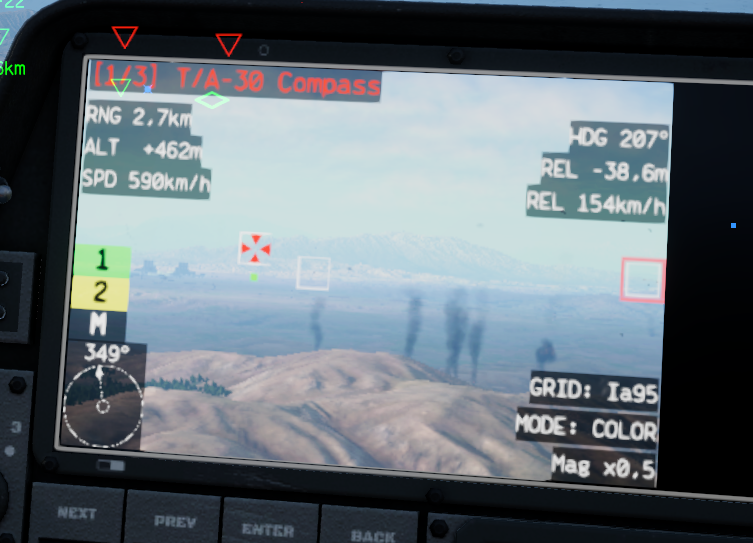
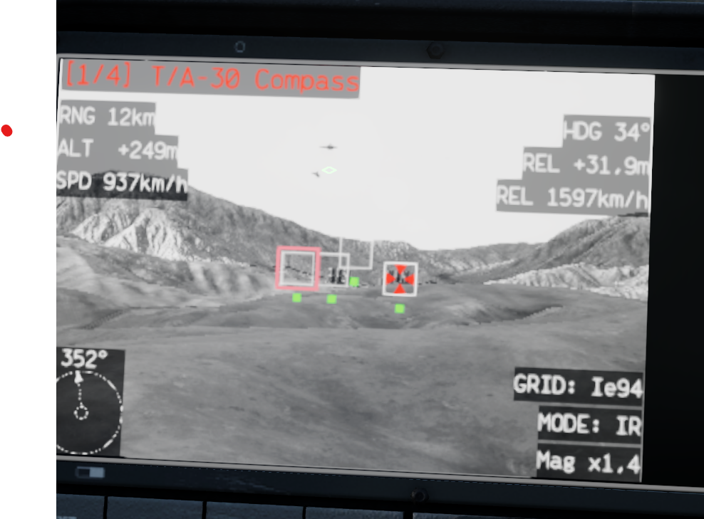
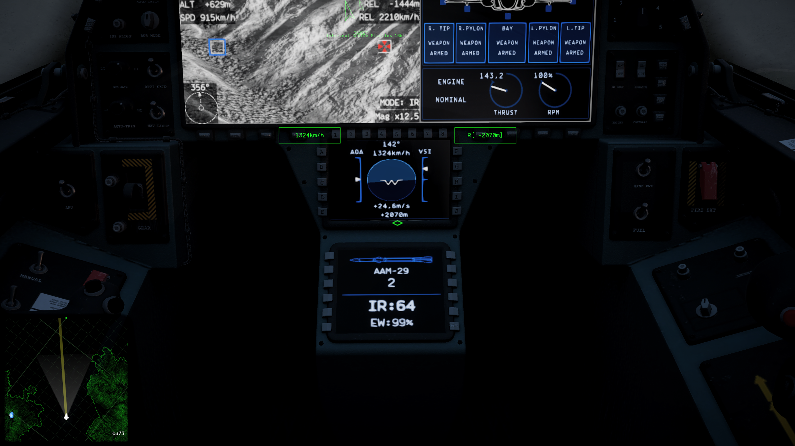
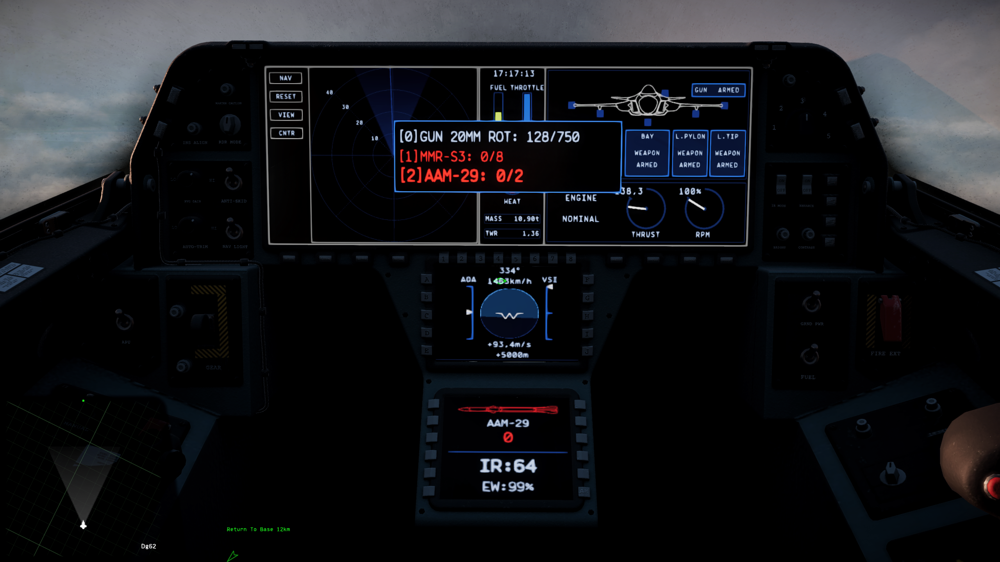
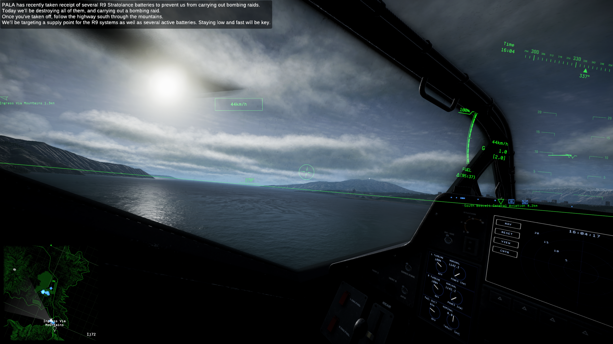
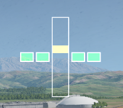
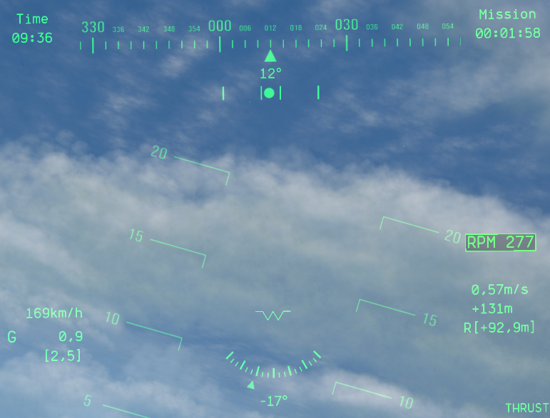
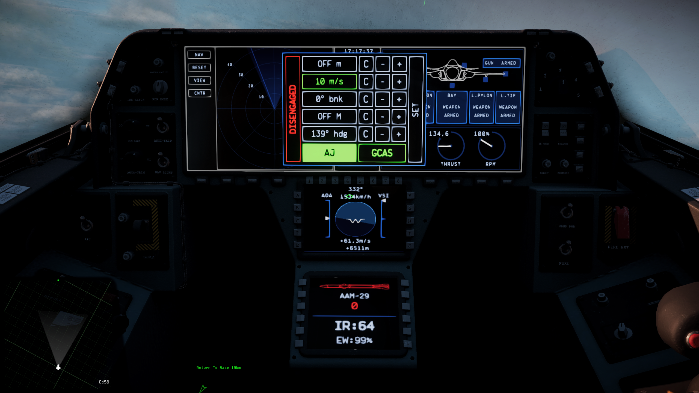

# ☢️ Nuclear Option Tactical Tools ☢️

---

## About

Nuclear Option Tactical Tools is an immersion and QoL focused gameplay mod.

The mod aims to enhance cockpit immersion and reduce repetitive UI actions without automating core combat mechanics, with a heavy focus on ensuring non-mod users are not at a disadvantage and a *vanilla* feel for the new functionalities.
Every component of the mod is togglable, and you can use your keyboard and HOTAS to interact with some of the new functionalities.

I sincerely hope you enjoy the mod as much as I enjoy developing it, feel free to hit me up on [Discord](https://discord.com/channels/909034158205059082/1387441277414539316) !

Fly safe,

George

## Main features

### **Combat & Targeting Features**

### 🎯 Interception vector on the target screen for single targets

- Only works for single targets
- Takes 3 seconds to spool up
- ETA and bearing are displayed at the bottom of the target screen
- The interception solution is not updated if the target is not tracked
- The interception solution is reset and deactivated when you are being jammed
- The solution is based on the target's last 3 seconds of movement to ensure this feature provides no advantage in combat

Screenshot :

### 💾 Target list handling (Uses [new bindings](#how-to-setup-the-mod-to-use-your-peripherals))

- Control and navigate through your target list
- Currently focused target is displayed on the targeting screen, as well as its information
- The inputs used for this feature will function when the Autopilot screen is not in use
- **Target Navigation** (Uses **MFD Nav Left/Right**):
  - **Short press** -> Cycle through selected targets (Previous/Next)
  - **Long press** -> Sort targets (Name/Distance)
- **Target Pop/Keep Only** (Uses **MFD Nav Enter**):
  - **Short press** -> Deselect current target
  - **Long press** -> Keep ONLY current target
- **Save/Recall Group** (Uses **MFD Nav Up**):
  - **Long press** -> Save target group
  - **Short press** -> Recall target group
- **Smart Filter** (Uses **MFD Nav Down**):
  - **Short press** -> Keep only data-linked targets
  - **Long press** -> Keep closest targets based on available ammo count

Screenshot :

### 💣 Target Screen delivery indicators and per-shot indicators to indicate launch/detonation "delivery" status

- Show indicators on each side of the Target Screen for each launched missile/bomb; indicators persist ~2s after impact
- Color delivery: green = armor hit, red = miss for instant outcome feedback
- Missiles are on the left side of the screen and bombs are on the right side of the screen

Screenshots :

### 🟢 Per-target Ammo Conservation indicator on the Target Screen
- Shows a green dot below the target box on the Target Screen if the target is already being tracked by a deliverable
- Works with multiple targets, each target will have its own indicator

Screenshot :

### 🔘 Separate, dedicated buttons for slot selection (Uses [new bindings](#how-to-setup-the-mod-to-use-your-peripherals))

- Can be assigned to any peripheral button
- Direct-select weapon slots via dedicated buttons (0–5)
- Slot order is based on the order weapons are first shown on the loadout screen

### 💥 Separate, dedicated buttons for Flares and Jammer selection (Uses [new bindings](#how-to-setup-the-mod-to-use-your-peripherals))

- Can be assigned to any peripheral button

### **Quality-of-Life Features**

### 📊 Weapon & Countermeasure Display MFD (Uses [new bindings](#how-to-setup-the-mod-to-use-your-peripherals))

- Shows flares/jammer status, current weapon name, and ammo in the cockpit
- Per-airframe layouts
- **Toggling between new and original content** (Uses **MFD Nav Toggle Screens**)
  - **Long press** -> Toggle between new and original content

Screenshots :

### 📋 Loadout Preview on main MFD

- Displays weapon loadout on the MFD on active slot switch
- Preview duration is configurable (default: 1 second)
- Automatically hides after the specified duration for uncluttered gameplay
- Can be setup to only be shown once when the airframe starts
- Can be setup to display on the HMD (main UI)
  - By default if the vanilla weapon panel is present, the loadout preview will follow its position
  - By default if the vanilla weapon panel is not present, the loadout preview will stay in the top right corner
  - The loadout preview's position is overridable with settings in Config Manager if you don't like the default behaviour

Screenshots :

### 📡 Unit marker distance indicator

- Changes HMD marker orientation for enemy air units when within a configurable distance threshold
  - The enemy unit's icon points downwards when the enemy unit is under the threshold
  - The speed at which the icon rotates when crossing the threshold indicates the enemy unit's speed
- Optional “near” sound cue

Screenshot :

### 🧭 Artificial Horizon on the HMD

- Horizon line always shown
- Cardinal directions are indicated and hidden when in front of the main HUD
- The transparency is configurable
- You can select for which airframe you want the Artificial Horizon to display by editing an included config file
  - The default airframes for this feature are:
    - SAH-46 Chicane
    - VL-49 Tarantula
    - UH-80 Ibis

Screenshot :

### 🛬 ILS Widget on the HUD
- Shows an ILS widget on the HUD when you are cleared for landing at a friendly runway
- The widget ranges from -1° to +1°, this setting is configurable
- The widget's position is adjustable in Config Manager

Screenshot :

### ⚖️ Bank Indicator on the HUD
- Shows a bank angle indicator on the HUD at all times
- The indicator ranges from -45° to +45°, the max angle is configurable
  - The preferred setting for the max angle is 45° since the needle will always point to the ground
- The indicator's position is adjustable in Config Manager
- The number of notches adapts to the max angle setting
- The transparency is configurable
- You can select for which airframe you want the Bank Indicator to display by editing an included config file
  - The default airframes for this feature are:
    - SAH-46 Chicane
    - VL-49 Tarantula
    - UH-80 Ibis
    - CI-22 Cricket
    - EW-1 Medusa
    - SFB-81
    - A-19 Brawler

Screenshot :

### ↗️ Slip/Skid Indicator on the HUD
- Shows a slip/skid indicator on the HUD at all times
- The indicator calculates the ratio between the lateral and upward acceleration to determine if you are slipping or skidding, and in which direction
- The sensitivity of the indicator (ratio at max offset) is adjustable in Config Manager
- The smoothing of the indicator is adjustable in Config Manager
- The indicator's position is adjustable in Config Manager
- The transparency is configurable
- You can select for which airframe you want the Slip/Skid Indicator to display by editing an included config file
  - The default airframes for this feature are:
    - SAH-46 Chicane
    - VL-49 Tarantula
    - UH-80 Ibis
    - CI-22 Cricket
    - EW-1 Medusa
    - SFB-81
    - A-19 Brawler

Screenshot :

### **Cosmetic & Enhancement Features**

### 🎨 Cockpit MFD color customization

- Set main and texts MFD colors
- Optional alternative attitude (horizon/ground) colors
- Works with vanilla and modded cockpit UI elements
- The MFD main color is updated in real time ingame

Screenshots :

### ⚡ Boot Screen animation

- A short booting animation is displayed on airframe start
- The animation lasts for 2 seconds

### **Camera features**

### 📷 New cockpit camera QoL inputs (Uses [new bindings](#how-to-setup-the-mod-to-use-your-peripherals))

- Adds a button that smoothly resets the cockpit's camera FOV to it's set default value when pressed
  - The reset speed is configurable in Config Manager
- Adds a button that focuses the cockpit's camera on the closest airbase when held

### **Mod Compatibility Features**

### 🛩️ NOAutopilot Control Menu (Uses [new bindings](#how-to-setup-the-mod-to-use-your-peripherals))

- Full HOTAS-friendly menu navigation for the [NOAutopilot mod](https://github.com/qwerty1423/no-autopilot-mod) with intuitive short/long press inputs
- Toggleables are visually indicated on the new MFD menu
- **Opening/Closing the menu** (Uses **MFD Nav Toggle Screens**):
  - **Short press** -> Open/Close the menu
- **Menu Navigation** (Uses **MFD Nav Up/Down/Left/Right**):
  - **Short press** -> Single-step navigation
  - **Long press** -> Continuous navigation
- **Staged Value Adjustment** (Uses **MFD Nav Enter** on +/- buttons):
  - **Short press** -> Increment/decrement by 1 step
  - **Long press** -> Rapid adjustment
- **Set Staged Value to Current** (Uses **MFD Nav Enter** on staged value fields):
  - Loads current flight values into editable fields, rounded to appropriate increments
- **Clear Staged Value** (Uses **MFD Nav Enter** on C buttons):
  - **Short press** -> Resets individual parameters to OFF state
  - **Long press** -> Resets all parameters to OFF state and disengages entire autopilot
- **Apply Staged Values** (Uses **MFD Nav Enter** on SET button):
  - Commits all staged values to the autopilot system
- **Speed Mode Toggle** (Uses **MFD Nav Enter** on Target Speed value field):
  - **Long press** -> Switches between **Mach** and **True Air Speed (TAS)** modes
- **Navigation Mode Toggle** (Uses **MFD Nav Enter** on Target Bearing value field):
  - **Long press** -> Enables/disables autopilot bearing hold mode
- **Extreme Throttle Toggle** (Uses **MFD Nav Enter** on Target Climb Rate value field):
  - **Long press** -> Allows autopilot to command full throttle range when enabled
- **System Toggles** (Uses **MFD Nav Enter** on specific buttons):
  - **Autopilot** -> Engage/disengage entire autopilot
  - **Auto-Jammer** -> Toggle automatic countermeasure deployment
  - **GCAS** -> Ground Collision Avoidance System on/off with status indication

Screenshots :

### **Deprecated Features**

### 🛡️ AA unit icon recolor on the main map (**DEPRECATED**)

- **I recommend you switch to the excellent Vanilla Icons Plus mod for the same
functionnality and more**
- **Download it [here](https://discord.com/channels/909034158205059082/1465420909295697942)**
- **Current mod users should deactivate the feature using Config Manager**
- Enemy AA units are recolored on the main map
- The color is configurable
- You can select which units are recolored by editing an included config file

## Installing

### :one: Installing BepInEx

- Download the BepInEx version corresponding to your OS [here](https://github.com/BepInEx/BepInEx/releases)
- Extract the content of the ZIP file to the root of your Nuclear Option folder (usually *[your steamapps folder]/common/Nuclear Option*)
- Your Nuclear Option folder should normally have a new folder called *BepInEx* inside

### :two: Installing Configuration Manager (to configure the mod)

- Download Configuration Manager [here](https://github.com/BepInEx/BepInEx.ConfigurationManager/releases)
  - **🚨 Make sure you download the BepInEx5 version 🚨**
- Extract the content of the ZIP file to the root of your Nuclear Option folder
- The BepInEx folder in your Nuclear Option folder should now have a new folder called *plugins* inside
- Press F1 in-game to display the configuration menu
- If the configuration menu doesn't show up, follow these steps :
  - Go to *Nuclear Option/BepInEx/config* and open *BepInEx.cfg*
  - Set **HideManagerGameObject** to **true**
  - You can change the shortcut by editing the setting **Show config manager** in *com.bepis.bepinex.configurationmanager.cfg*

### :three: Installing the mod

- Download Nuclear Option Tactical Tools [here](https://github.com/clumzy/NO_Tactitools/releases)
- Extract the content of the ZIP file in *Nuclear Option/BepInEx/plugins* (where Configuration Manager is already located)
- The plugins folder should now have a new folder called *NOTT* inside

## Configuring the mod

### How to activate/deactivate and configure features

- Open Configuration Manager once the main menu of Nuclear Option is loaded
- Click on the *NOTT* tab
- Hovering your mouse over each setting will give you more details
- Disable/Enable the components you want, and edit their settings if appliable
- **RESTART THE WHOLE GAME** (activated mod components are patched on game start)

### Advanced configuration (Unit Icon Recolor, Artificial Horizon, Slip Indicator, Bank Indicator)

You can configure these modules using text files located in the mod's folder.
As time goes on I will allow more features to be precisely configured using text files.

- Open the *config* folder located in *Nuclear Option/BepInEx/plugins/NOTT*
- Open the two text files and follow the instructions in the comments (comments start with *//*)

### How to setup the mod to use your peripherals

- Open Configuration Manager once the main menu of Nuclear Option is loaded
- Click on the *NOTT* tab
- Bind the controls as you would in-game
  - Press ESC to cancel the assignement
  - Press SUPPR to clear the assignement (**I STRONGLY RECOMMEND USING THIS INSTEAD OF "Reset"**)
- That's it !

## Compatibility

### Compatible mods

- **QoL** (qol_1.1.6.1b3)
- **FQ-106** Kestrel (fq106_2.0.2)
- **Vanilla Icons PLUS** (VanillaIconsPLUS_1.5.1)
- **NOAutopilot** (NOAutopilot v4.17.1)
- **ThirdPersonHud** (ThirdPersonHud v1.2.2)

## Common issues

### I've activated/deactivated a feature but I don't see any change ingame

Restart the game, **I BEG YOU**.

## Contributing

### Reporting bugs

- You can either send me a DM on Discord (look for *cleunaygeorges*), or report it in [the mod's thread](https://discord.com/channels/909034158205059082/1387441277414539316)
- You can also submit an issue on GitHub
- When submitting bugs, I request that you provide two files :
  - *LogOutput.log*, found in *[your steam folder]/steamapps/common/Nuclear Option/BepInEx/*
  - *Player.log*, found in *[your user folder]/AppData/LocalLow/Shockfront/NuclearOption/*
- Please be as descriptive as possible so that I can reproduce the bug
- **NO LOGS, NO HELP**

### Contributing to the mod

- Feel free to suggest additions
- You can also submit a pull request if you want to help me develop the mod !

## FAQ

*Coming soon*
