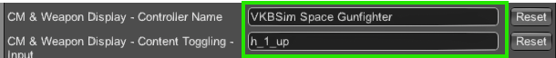

# ☢️ Nuclear Option Tactical Tools ☢️
---
## About
Nuclear Option Tactical Tools is an immersion and QoL focused gameplay mod. 

The mod aims to enhance cockpit immersion and reduce repetitive UI actions without automating core combat mechanics, with a heavy focus on ensuring non-mod users are not at a disadvantage and a *vanilla* feel for the new functionalities. 
Every component of the mod is togglable, and you can use your keyboard and HOTAS to interact with some of the new functionalities.

I sincerely hope you enjoy the mod as much as I enjoy developing it, feel free to hit me up on [Discord](https://discord.com/channels/909034158205059082/1387441277414539316) !

Fly safe,

George

## Main features

### 🎯 Interception vector on the target screen for single targets
- Only works for single targets
- Takes 3 seconds to spool up
- ETA and bearing are displayed at the bottom of the target screen
- The interception solution is not updated if the target is not tracked
- The interception solution is reset and deactivated when you are being jammed

### 💾 Target list handling (HOTAS, Mouse and Keyboard)
- Control and navigate through your target list
- Currently focused target is displayed on the targeting screen
- **Save/Recall Group**: Can be assigned to any peripheral button
  - **Long press** -> Save target group
  - **Short press** -> Recall target group
  - Saved target group is reset on respawn
- **Target Navigation**: Can be assigned to separate buttons
  - Cycle through selected targets (Next/Previous)
- **Target Selection**: Can be assigned to any peripheral button
  - **Short press** -> Deselect current target
  - **Long press** -> Keep ONLY current target
- **Smart Filter**: Can be assigned to any peripheral button
  - **Short press** -> Keep only data-linked targets
  - **Long press** -> Keep closest targets based on available ammo count

### 🔘 Separate, dedicated buttons for slot selection (HOTAS, Mouse and Keyboard)
- Can be assigned to any peripheral button
- Direct-select weapon slots via dedicated buttons (0–5)
- Slot order is based on the order weapons are first shown on the loadout screen
- Long-press on slot 0 toggles Turret Auto Control

### 💥 Separate, dedicated buttons for Flares and Jammer selection (HOTAS, Mouse and Keyboard)
- Can be assigned to any peripheral button

### 💣 HUD delivery bar and per-shot indicators to indicate launch/detonation “delivery” status
- Show icons for each launched missile/bomb on the target screen; icons persist ~2s after impact and clear on respawn
- Color delivery: green = armor hit, red = miss for instant outcome feedback
- Distinct shapes: missiles are diamond-shaped, bombs are square-shaped for quick ordnance ID

### 📊 Weapon & Countermeasure Display MFD (HOTAS, Mouse and Keyboard support)
- Shows flares/jammer status, current weapon name, and ammo in the cockpit
- Toggle between modded and original content
  - Can be assigned to any peripheral button
- Per-airframe layouts

### 📋 Loadout Preview on main MFD
- Displays weapon loadout on the MFD on active slot switch
- Preview duration is configurable (default: 1 second)
- Automatically hides after the specified duration for uncluttered gameplay
- Can be setup to only be shown once when the airframe starts
- Can be setup to display on the HMD (main UI)
  - By default if the vanilla weapon panel is present, the loadout preview will follow its position
  - By default if the vanilla weapon panel is not present, the loadout preview will stay in the top right corner
  - The loadout preview's position is overridable with settings in Config Manager if you don't like the default behaviour

### 📡 Unit marker distance indicator
- Changes HMD marker orientation for enemy air units when within a configurable distance threshold
  - The enemy unit's icon points downwards when the enemy unit is under the threshold
  - The speed at which the icon rotates when crossing the threshold indicates the enemy unit's speed
- Optional “near” sound cue

### 🎨 Cockpit MFD color customization
- Set main and texts MFD colors
- Optional alternative attitude (horizon/ground) colors
- Works with vanilla and modded cockpit UI elements
- The MFD main color is updated in real time ingame

### 🧭 Artificial Horizon for Chicane, Ibis and Tarantula (by default)
- Horizon line always shown
- Cardinal directions are indicated and hidden when in front of the main HUD
- You can select for which airframe you want the Artificial Horizon to display by editing an included config file
- The transparency is configurable

### ⚡ Boot Screen animation
- A short booting animation is displayed on airframe start
- The animation lasts for 2 seconds

### 🛡️ AA unit icon recolor on the main map (**DEPRECATED**)
- **I recommend you switch to the excellent Vanilla Icons Plus mod for the same
functionnality and more**
- **Download it [here](https://discord.com/channels/909034158205059082/1452350628155228342)**
- **Current mod users should deactivate the feature using Config Manager**
- Enemy AA units are recolored on the main map
- The color is configurable
- You can select which units are recolored by editing an included config file

## Installing

### :one: Installing BepInEx
- Download the BepInEx version corresponding to your OS [here](https://github.com/BepInEx/BepInEx/releases)
- Extract the content of the ZIP file to the root of your Nuclear Option folder (usually *[your steamapps folder]/common/Nuclear Option*)
- Your Nuclear Option folder should normally have a new folder called *BepInEx* inside

### :two: Installing Configuration Manager (to configure the mod)
- Download Configuration Manager [here](https://github.com/BepInEx/BepInEx.ConfigurationManager/releases)
  - **🚨 Make sure you download the BepInEx5 version 🚨**
- Extract the content of the ZIP file to the root of your Nuclear Option folder
- The BepInEx folder in your Nuclear Option folder should now have a new folder called *plugins* inside
- Press F1 in-game to display the configuration menu
- If the configuration menu doesn't show up, follow these steps :
  - Go to *Nuclear Option/BepInEx/config* and open *BepInEx.cfg*
  - Set **HideManagerGameObject** to **true**
  - You can change the shortcut by editing the setting **Show config manager** in *com.bepis.bepinex.configurationmanager.cfg*

### :three: Installing the mod
- Download Nuclear Option Tactical Tools [here](https://github.com/clumzy/NO_Tactitools/releases)
- Extract the content of the ZIP file in *Nuclear Option/BepInEx/plugins* (where Configuration Manager is already located)
- The plugins folder should now have a new folder called *NOTT* inside

## Configuring the mod

### How to activate/deactivate and configure features
- Open Configuration Manager once the main menu of Nuclear Option is loaded
- Click on the *NOTT* tab
- Hovering your mouse over each setting will give you more details
- Disable/Enable the components you want, and edit their settings if appliable
- **RESTART THE WHOLE GAME** (activated mod components are patched on game start)

### Advanced configuration (Unit Icon Recolor and Artificial Horizon)
You can configure the Unit Icon Recolor and Artificial Horizon using text files located in the mod's folder.
As time goes on I will allow more features to be precisely configured using text files.
- Open the *config* folder located in *Nuclear Option/BepInEx/plugins/NOTT*
- Open the two text files and follow the instructions in the comments (comments start with *//*)

### How to setup the mod to use your HOTAS and keyboard
The process is a bit convoluted, I admit. Since the game is using ReWired for its inputs, I had to reverse engineer some obfuscated code and I haven't managed to leverage the ingame bindings menu for now. However what I have for now should work in a stable and surefire way !

#### Setting up HOTAS buttons
- Go to the ingame bindings menu
- Bind a new control using the button you want to use
- Write down the number of the button, and the name of the peripheral (don't forget to remove the binding you used to get the button number)
- Open Configuration Manager and the NOTT tab
- Input the name of the peripheral and its button (only the number) in the relevant settings
- Repeat as needed
- **RESTART THE GAME**

Example :

#### Setting up HOTAS hats
- Go to the ingame bindings menu
- Bind a new control using the hat you want to use
  - You'll get an output in the format **Hat {number} {direction}**
- Write down the number of the hat, its direction (only *up, left, down* and *right* are supported for now), and the name of the peripheral (don't forget to remove the binding you used to get the hat info)
- Open Configuration Manager and the NOTT tab
- Input the name of the peripheral in the relevant setting
- Input the hat control in the following format : **h_{number}_{direction}**
- Repeat as needed
- **RESTART THE GAME**

Example :

#### Setting up mouse inputs
- Same procedure as with HOTAS buttons except that the peripheral is **Mouse**

#### Setting up keyboard inputs
- Go to the ingame bindings menu
- Bind a new control using the keyboard input you want to use
- Write down the input the game has detected
  - This is important if you're not using a QWERTY keyboard, the input displayed will likely not be the same as what's on your keyboard
- Look up its relevant KeyCode (Unity's way of storing keyboard inputs) [here](https://docs.unity3d.com/ScriptReference/KeyCode.html)
- Open Configuration Manager and the NOTT tab*
- The name of the peripheral in the relevant setting **must be Keyboard**
- Input the key code you got earlier in the relevant setting
- **RESTART THE GAME**

Example :

## Compatibility
### Compatible mods
- **QoL** (qol_1.1.6.1b3)
- **FQ-106** Kestrel (fq106_2.0.2)
- **Vanilla Icons PLUS** (VanillaIconsPLUS_1.5.0)

## Common issues

### My settings haven't been applied
Restart the game, **I BEG YOU**.

### My peripheral is not recognized
Sometimes the internal name of a peripheral is not the same as the one displayed in the menus.
- Ensure you have activated Debug mode in the NOTT settings
- Open the BepInEx log file, called *LogOutput.log*, located in *Nuclear Option/BepInEx/*
- Look for lines that start with *[IC] Controller connected :*
- Write down the name of the controller, if it is different than the one you see ingame, this is the one you must use in the NOTT config menu

## Contributing

### Reporting bugs
- You can either send me a DM on Discord (look for *cleunaygeorges*), or report it in [the mod's thread](https://discord.com/channels/909034158205059082/1387441277414539316)
- You can also submit an issue on GitHub
- When submitting bugs, I request that you provide two files :
  - *LogOutput.log*, found in *[your steam folder]/steamapps/common/Nuclear Option/BepInEx/*
  - *Player.log*, found in *[your user folder]/AppData/LocalLow/Shockfront/NuclearOption/*
- Please be as descriptive as possible so that I can reproduce the bug
- **NO LOGS, NO HELP**

### Contributing to the mod
- Feel free to suggest additions
- You can also submit a pull request if you want to help me develop the mod !
## FAQ
*Coming soon*
